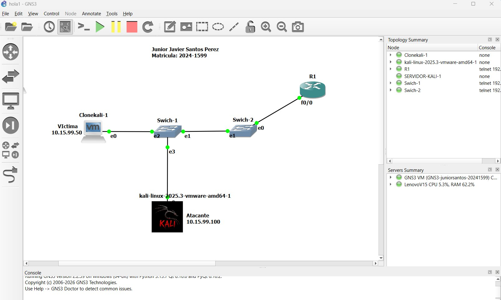
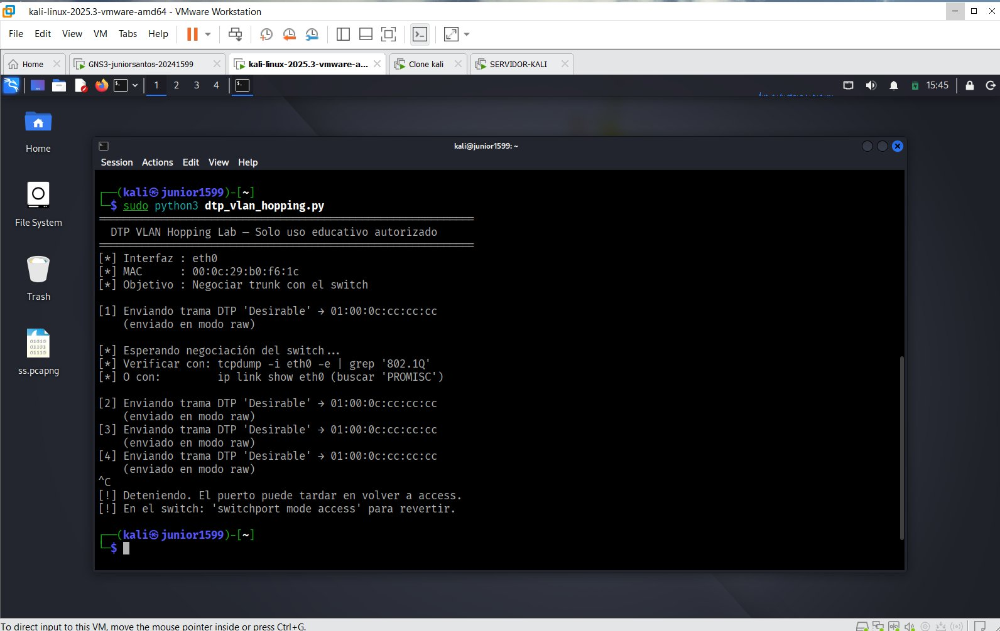
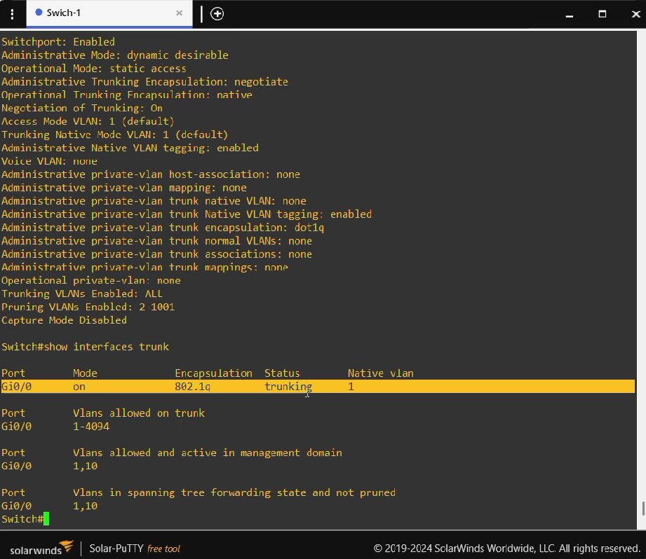

# DTP VLAN Hopping Attack

Autor: Junior Javier Santos Perez

Matrícula: 2024-1599

Entorno: GNS3 + VMware Workstation + Kali Linux 2025.3

Repositorio GitHub:
https://github.com/juniorjaviersantosperez/DTP-VLAN-Hopping

Video demostrativo:
https://www.youtube.com/watch?v=6qAcfXVOTVo&t=63s 


---

## 1. Objetivo del Laboratorio

Demostrar el ataque **DTP VLAN Hopping** mediante el cual un atacante conectado a un puerto de acceso (*access*) de un switch Cisco puede enviar tramas DTP falsas para convencer al switch de elevar ese puerto a modo *trunk*, obteniendo así visibilidad del tráfico de **todas las VLANs** de la red, rompiendo el aislamiento que las VLANs ofrecen.

Al finalizar el laboratorio se demuestra también la **mitigación** del ataque mediante la desactivación del protocolo DTP en los puertos de usuario.

---

## 2. Objetivo del Script

El script `dtp_vlan_hopping.py` automatiza el envío de tramas DTP maliciosas desde la máquina del atacante hacia el switch Cisco, con el objetivo de negociar automáticamente un enlace trunk en un puerto que originalmente era de acceso.

### 2.1 Parámetros configurables

| Parámetro | Valor usado | Descripción |
|---|---|---|
| `IFACE` | `eth0` | Interfaz de red del atacante conectada al switch |
| `DTP_MULTICAST` | `01:00:0c:cc:cc:cc` | Dirección multicast destino del protocolo DTP |
| `ARP_INTERVAL` | `30` segundos | Intervalo entre envíos de tramas DTP |

### 2.2 Requisitos para utilizar la herramienta

- Sistema operativo: **Kali Linux** (o cualquier Linux con privilegios root)
- Python 3.x instalado
- Librería **Scapy**:
```bash
pip install scapy
```
- Conexión directa al switch Cisco (no a través de otro dispositivo)
- Puerto del switch en modo `dynamic auto` o `dynamic desirable` (DTP activo)
- Ejecutar con privilegios root:
```bash
sudo python3 dtp_vlan_hopping.py
```

---

## 3. Documentación del Funcionamiento del Script

El script opera en los siguientes pasos:

**Paso 1 — Obtener la MAC de la interfaz**  
Usa `get_if_hwaddr(IFACE)` de Scapy para obtener la dirección MAC real de `eth0`, que será incluida en las tramas DTP como identificador del "vecino".

**Paso 2 — Construir la trama DTP en modo raw**  
Construye manualmente una trama Ethernet 802.3 con los siguientes campos:
- Destino: `01:00:0c:cc:cc:cc` (multicast DTP de Cisco)
- LLC SNAP header con OUI Cisco (`00:00:0c`) y PID DTP (`20:04`)
- TLVs DTP: Domain vacío, Status `0x83` (Desirable), Type `0xa5` (802.1Q), Neighbor con la MAC del atacante

**Paso 3 — Enviar la trama al switch**  
Usa un socket L2 de Scapy para enviar la trama directamente a nivel de capa 2, sin pasar por el stack IP del sistema operativo.

**Paso 4 — Repetir cada 30 segundos**  
El switch espera tramas DTP periódicas para mantener la negociación activa. El script las reenvía continuamente hasta que el usuario lo detiene con `Ctrl+C`.

**Resultado esperado en el switch**  
El switch recibe la trama DTP con modo `Desirable` y, si su puerto está en `dynamic auto` o `dynamic desirable`, responde elevando el puerto a modo **trunk** con encapsulación 802.1Q.

---

## 4. Documentación de la Red

### 4.1 Topología

```
  Clonekali-1 (Víctima)                    R1
  10.15.99.50                            (Router)
       |                                    |
      e0                                  f0/0
       |                                    |
      e2 ──── Swich-1 ──── e1 ──── Swich-2 ── e0
               |    e1              e1
              e3
               |
        kali-linux (Atacante)
          10.15.99.100
```

### 4.2 Dispositivos y direccionamiento

| Dispositivo | Rol | IP | Interfaz en Switch |
|---|---|---|---|
| kali-linux-2025.3 | Atacante | 10.15.99.100 | Swich-1 → Gi0/3 (e3) |
| Clonekali-1 | Víctima | 10.15.99.50 | Swich-1 → Gi0/2 (e2) |
| SERVIDOR-KALI-1 | Servidor | 10.15.99.150 | Swich-2 |
| Swich-1 | Switch principal | — | Gi0/0 uplink SW2 |
| Swich-2 | Switch secundario | — | Gi0/0 uplink SW1 |
| R1 | Router gateway | 10.15.99.1 | f0/0 → Swich-2 |

### 4.3 VLANs configuradas

| VLAN ID | Nombre | Dispositivos |
|---|---|---|
| 1 | default | Nativa / gestión |
| 10 | VENTAS | Víctima, Atacante, Servidor |

### 4.4 Estado de puertos relevantes en Swich-1

| Puerto | Modo inicial | VLAN | Dispositivo |
|---|---|---|---|
| Gi0/0 | trunk (on) | 1, 10 | Uplink → Swich-2 |
| Gi0/1 / Gi0/3 | dynamic desirable | 10 | Atacante (Kali) |
| Gi0/2 | dynamic auto | 10 | Víctima (Clonekali) |

---

## 5. Procedimiento del Laboratorio

### Paso 1 — Verificar estado inicial del puerto (vulnerable)

```
Switch#show interfaces Gi0/3 switchport
```

Resultado que muestra la vulnerabilidad:
```
Administrative Mode: dynamic desirable
Negotiation of Trunking: On
Operational Mode: static access
```

### Paso 2 — Ejecutar el ataque desde Kali

```bash
sudo python3 dtp_vlan_hopping.py
```

El script comienza a enviar tramas DTP cada 30 segundos:
```
[*] Interfaz : eth0
[*] MAC      : 00:0c:29:b0:f6:1c
[1] Enviando trama DTP 'Desirable' → 01:00:0c:cc:cc:cc
    (enviado en modo raw)
[*] Esperando negociación del switch...
```

### Paso 3 — Verificar el éxito del ataque en el switch

```
Switch#show interfaces trunk
```

Resultado que confirma el ataque exitoso:
```
Port    Mode        Encapsulation   Status      Native vlan
Gi0/0   on          802.1q          trunking    1
Gi0/3   desirable   n-802.1q        trunking    1
```

`Gi0/3` pasó de **access** a **trunking** — el atacante ahora tiene acceso a VLANs 1-4094.


---

## 6. Capturas de Pantalla

### Topología en GNS3


### Script ejecutándose en Kali — enviando tramas DTP


### Estado inicial del puerto — vulnerable (Negotiation: On)


### Ataque fallido — puerto aún en access (fase diagnóstico)


### Ataque exitoso — Gi0/3 en trunking


### Mitigación aplicada — DTP desactivado


---

## 7. Contramedidas

### 7.1 Comandos de mitigación

Aplicar en **todos** los puertos de usuario del switch:

```
Switch#configure terminal
Switch(config)#interface range Gi0/1 - 3
Switch(config-if-range)#switchport mode access
Switch(config-if-range)#switchport nonegotiate
Switch(config-if-range)#end
Switch#wr
```

### 7.2 Qué hace cada comando

| Comando | Efecto |
|---|---|
| `switchport mode access` | Fuerza el puerto a permanecer siempre en access. No puede negociar trunk sin importar lo que el otro extremo envíe |
| `switchport nonegotiate` | Desactiva DTP completamente. El puerto no envía ni responde tramas DTP |
| `wr` | Guarda la configuración en memoria no volátil (NVRAM) |

### 7.3 Verificación de la mitigación

```
Switch#show interfaces Gi0/3 switchport | include Mode|Negotiation
```

Resultado esperado tras mitigación:
```
Administrative Mode: static access
Negotiation of Trunking: Off
```

### 7.4 Tabla completa de contramedidas

| Técnica | Comando | Protege contra |
|---|---|---|
| Forzar modo access | `switchport mode access` | Negociación trunk no autorizada |
| Desactivar DTP | `switchport nonegotiate` | Tramas DTP maliciosas |
| Cambiar VLAN nativa | `switchport trunk native vlan 999` | Double Tagging |
| Apagar puertos sin uso | `shutdown` | Conexiones no autorizadas |
| VLAN de cuarentena | `switchport access vlan 999` | Aislamiento de puertos no usados |

### 7.5 Regla general de configuración segura

| Tipo de puerto | Configuración correcta |
|---|---|
| Puerto de usuario / PC | `switchport mode access` + `switchport nonegotiate` |
| Enlace entre switches | `switchport mode trunk` + `switchport nonegotiate` |
| Nunca usar en producción | `dynamic auto` o `dynamic desirable` |

---

## 8. Conclusión

El ataque DTP VLAN Hopping demuestra cómo una función de conveniencia de Cisco — la negociación automática de trunk — puede ser explotada por un atacante para romper el aislamiento de VLANs desde un simple puerto de usuario. La mitigación es sencilla y efectiva: dos comandos por puerto eliminan completamente la superficie de ataque.

---
## ⚠️ Aviso Legal

Este laboratorio es exclusivamente para fines educativos en un entorno controlado. El uso de estas técnicas fuera de un entorno autorizado es ilegal y viola la Ley 53-07 sobre Crímenes y Delitos de Alta Tecnología de la República Dominicana.
